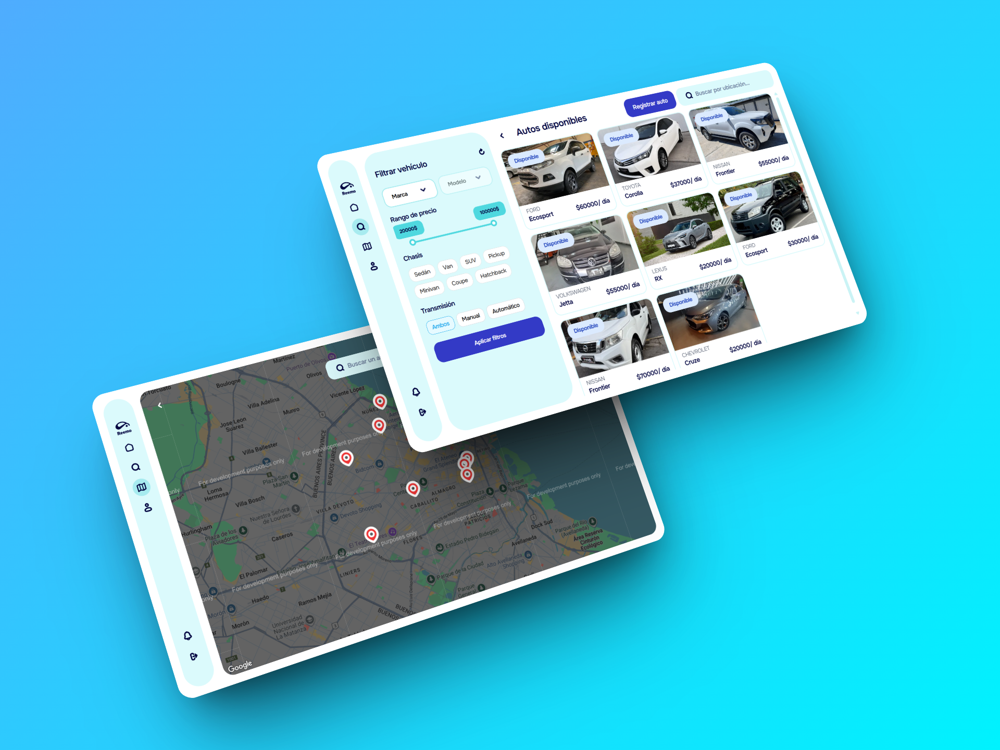

<div align="center">
  <a name="readme-top"></a>
  

## Web oficial de Reemo

**Reemo** es una plataforma innovadora de alquiler de vehículos entre particulares que conecta de forma simple, segura y confiable a propietarios y arrendatarios.  
Permite a los dueños generar ingresos con sus autos y a los usuarios encontrar el vehículo ideal para sus necesidades de movilidad.

</div>

## 📸 Capturas de pantalla

<p align="center">
  
  
  
  
  
</p>

## ✨ Funcionalidades

- 🚙 **Publicación de vehículos**: Registrar un auto con toda su información e imágenes.  
- 🔑 **Autenticación**: Registro, inicio y cierre de sesión de usuarios.  
- 📩 **Notificaciones de alquiler**: Solicitudes en tiempo real con opción de aceptar o rechazar.  
- 🛠 **Gestión de vehículos propios**: Habilitar, deshabilitar o eliminar autos de la plataforma.  
- 👤 **Gestión de perfil**: Actualización de datos de usuario.  

## 🛠 Tecnologías utilizadas

 
Construcción de la interfaz de usuario.  
 
Autenticación, Firestore Database y almacenamiento en la nube.  

Estilos modernos y responsivos.  

Integraciones y servicios backend.  

Geolocalización y visualización de ubicaciones.  

## 🚀 Cómo ejecutar el proyecto

1. Clonar el repositorio:  
   ```bash
   git clone https://github.com/tu-usuario/reemo.git
   cd reemo
2. Instalar las dependencias necesarias:  
   ```bash
   npm i
3. Iniciar el servidor de desarrollo: 
   ```bash
   npm run dev
4. Abrir en el navegador en: 
   ```bash
   http://localhost:5173/
## 📌 Sobre el proyecto
**Reemo** busca transformar la forma en que las personas acceden a un vehículo, ofreciendo una experiencia basada en confianza, accesibilidad y seguridad, y creando una comunidad innovadora en el sector de movilidad.

## 🤝 Contribuciones
¡Toda contribución es bienvenida!
Si quieres colaborar, abre un issue o envía un pull request con tus mejoras.

**¡Gracias a todos los colaboradores que han hecho posible este proyecto!**

<a href="https://github.com/panadxro/Reemo/graphs/contributors">
  
</a>


<p align="right">(<a href="#readme-top">volver al inicio</a>)</p>
